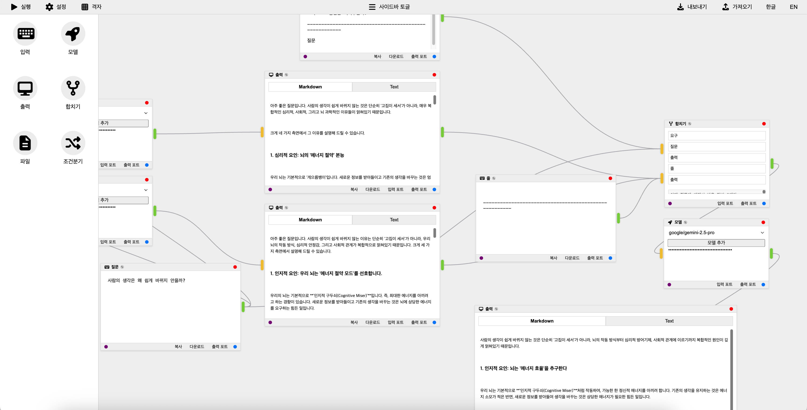

# LogiCanvas

## 프로젝트 개요 / Project Overview
이 프로젝트는 노드 기반 데이터 흐름 애플리케이션의 프로토타입으로, 사용자가 시각적으로 노드를 연결하여 실시간 AI 텍스트를 생성할 수 있습니다. 브라우저에서 실행되는 웹 앱으로, 입력 프롬프트 노드, 파일 입력 노드, 모델 선택 노드, 합치기(Merge) 노드, 조건분기(Condition) 노드, 출력 표시 노드가 연결되어 데이터가 입력에서 모델을 거쳐 출력으로 흐릅니다. "실행" 버튼으로 AI 생성을 WebSocket을 통해 Python 백엔드로 트리거합니다.

앱은 OpenAI, Google GenAI, xAI와 같은 AI API로부터 스트리밍 응답을 지원합니다. 헤더에 노드 추가 버튼이 있으며, 캔버스 더블클릭으로 노드 팔레트 열기, 입력/파일/모델/합치기/조건분기/출력 노드를 동적으로 추가할 수 있습니다. 그룹화 (Ctrl+G), 바이패스 (Ctrl+B), 복사/붙여넣기 (Ctrl+C/V, Shift+V로 연결 유지), 삭제 (Delete), Export/Import 워크플로우 기능이 구현되었습니다. 추가로 노드 제목 편집 (✎ 아이콘), 동적 포트 추가/제거 (더블클릭), 입력 포트 우선순위 드래그 (vuedraggable), 리사이즈 핸들 (그리드 스냅 지원), 핸들 스타일 커스텀 (색상 세로선, 돌출, 그림자) 등이 포함됩니다.

This project is a prototype of a node-based data flow application where users can visually connect nodes to generate real-time AI text. It is a web app that runs in the browser, with input prompt nodes, file input nodes, model selection nodes, merge nodes, condition nodes, and output display nodes connected so that data flows from input through the model to output. The "Execute" button triggers AI generation via WebSocket to a Python backend.

The app supports streaming responses from AI APIs such as OpenAI, Google GenAI, and xAI. There are buttons in the header to add nodes, and double-clicking the canvas opens a node palette to dynamically add input/file/model/merge/condition/output nodes. Features include grouping (Ctrl+G), bypassing (Ctrl+B), copy/paste (Ctrl+C/V, Shift+V to keep connections), deletion (Delete), and Export/Import workflow. Additionally, it includes node title editing (✎ icon), dynamic port addition/removal (double-click), input port priority dragging (vuedraggable), resize handles (with grid snap support), and custom handle styles (colored vertical lines, protrusions, shadows).

## 스크린샷 / screenshot


## 주요 기능 / Key Features
- Vue Flow를 사용한 시각적 노드 캔버스: 드래그, 크기 조정 (Resize 핸들, 그리드 스냅), 노드 연결, 엣지 더블클릭 제거.
- 실시간 스트리밍 AI 텍스트 생성.
- 드롭다운 모델 선택(OpenAI GPT-4.1, Google Gemini-2.5 Flash/Pro, xAI Grok-4-0709)과 사용자 정의 추가.
- API 키 관리: 글로벌(서버 측 저장, crypto-js로 암호화) 또는 노드별 오버라이드.
- 국제화: 영어와 한국어 지원 (브라우저 언어 자동 감지).
- 로깅: 출력 노드에서 클립보드 복사 또는 JSON 다운로드, 입력 노드에서 프롬프트 복사/다운로드.
- 에러 핸들링: 네트워크, 유효하지 않은 키 (401), 할당량 제한 (429), 알 수 없는 오류.
- 배포: 웹 우선, 단일 명령으로 통합 서빙.
- 노드 추가: 헤더 버튼 또는 캔버스 더블클릭으로 팔레트 열기 (검색 가능, vue-virtual-scroller 사용).
- 흐름 실행: DFS 기반 순환 감지와 토폴로지 정렬 traversal로 완전한 입력-모델-출력 경로 실행.
- 추가: 노드 그룹화/바이패스/복사/붙여넣기/삭제 키 단축키, 워크플로우 Export/Import, 동적 포트 (추가/제거, 더블클릭), Handle 스타일 커스텀 (입력: 노란색, 출력: 연한 녹색 세로선, 돌출, 그림자), 제목 편집 (✎ 아이콘), Merge 노드 입력 포트 우선순위 드래그 (vuedraggable), Condition 노드 (드래그 가능한 선택, 연산자, 값 비교).
  
- Visual node canvas using Vue Flow: Drag, resize (Resize handles, grid snap), node connection, edge double-click removal.
- Real-time streaming AI text generation.
- Dropdown model selection (OpenAI GPT-4.1, Google Gemini-2.5 Flash/Pro, xAI Grok-4-0709) and custom additions.
- API key management: Global (server-side storage, encrypted with crypto-js) or per-node override.
- Internationalization: English and Korean support (browser language auto-detection).
- Logging: Clipboard copy or JSON download from output nodes, prompt copy/download from input nodes.
- Error handling: Network, invalid key (401), quota limit (429), unknown errors.
- Deployment: Web-first, integrated serving with a single command.
- Node addition: Header buttons or canvas double-click to open palette (searchable, using vue-virtual-scroller).
- Flow execution: DFS-based cycle detection and topological sort traversal for complete input-model-output path execution.
- Additional: Node grouping/bypassing/copy/paste/delete keyboard shortcuts, workflow Export/Import, dynamic ports (add/remove, double-click), Handle style custom (input: yellow, output: light green vertical line, protrusion, shadow), title editing (✎ icon), Merge node input port priority drag (vuedraggable), Condition node (draggable selections, operators, value comparison).

## 기술 스택 / Technology Stack
### 백엔드 (Python 3.12+) / Backend (Python 3.12+)
- aiohttp: WebSocket과 서버.
- openai, google-genai, xai-sdk: AI API.
- aiohttp-cors: 프론트엔드 통합.
- pycryptodome: API 키 복호화.

- aiohttp: WebSocket and server.
- openai, google-genai, xai-sdk: AI APIs.
- aiohttp-cors: Frontend integration.
- pycryptodome: API key decryption.

### 프론트엔드 (Vue.js 3) / Frontend (Vue.js 3)
- Vite: 빌드 도구.
- @vue-flow/core 및 @vue-flow/node-resizer: 노드 기반 UI 및 크기 조정.
- vue-i18n: 지역화.
- crypto-js: API 키 암호화.
- pinia: 상태 관리.
- vue-virtual-scroller: 팔레트 가상 스크롤.
- vuedraggable: Merge 노드 포트 우선순위 드래그.
- @fortawesome/fontawesome-free: 아이콘.

- Vite: Build tool.
- @vue-flow/core and @vue-flow/node-resizer: Node-based UI and resizing.
- vue-i18n: Localization.
- crypto-js: API key encryption.
- pinia: State management.
- vue-virtual-scroller: Palette virtual scroll.
- vuedraggable: Merge node port priority drag.
- @fortawesome/fontawesome-free: Icons.

## 폴더 구조 / Folder Structure
```project_root/
├── readme.md
├── requirements.txt
├── main.py
└── static/ (빌드된 프론트엔드 정적 파일)
```

## 설치 및 설정 / Installation and Setup
### 사전 요구사항 / Prerequisites
- Python 3.12+

### 설치 / Installation
```cd backend_aiohttp
python -m venv venv
source venv/bin/activate # Unix 또는 venv\Scripts\activate (Windows)
pip install -r requirements.txt
python main.py --serve-static # http://localhost:8080에서 앱 서빙
```

## 사용법 / Usage
- 브라우저에서 앱 열기 (localhost:8080).
- 헤더에서 입력/파일/모델/합치기/조건분기/출력 노드 추가 또는 캔버스 빈 공간 더블클릭으로 팔레트 열기 (검색 가능).
- 입력 노드에 프롬프트 입력 (복사/다운로드 가능), 파일 노드에 .txt 업로드.
- 모델 노드에서 모델 선택하고 API 키 입력 (설정으로 글로벌 또는 노드별).
- 노드 연결 (입력 -> 합치기 -> 모델 -> 출력, 타입 체크), 엣지 더블클릭으로 제거.
- 포트 추가: 노드 바닥 버튼 클릭, 포트 제거: 핸들 더블클릭 (Condition 출력 포트 고정).
- Merge 노드: 입력 포트 드래그로 우선순위 조정, 합쳐진 결과 실시간 표시.
- Condition 노드: 입력 항목을 조건/참/거짓 분기로 드래그, 연산자/값 설정 (숫자 검증).
- 노드 제목 편집: 헤더 ✎ 아이콘 클릭.
- 크기 조정: 오른쪽 아래 핸들 드래그 (그리드 활성화 시 스냅).
- 키 단축키: Ctrl+G (그룹화), Ctrl+B (바이패스), Ctrl+C/V (복사/붙여넣기), Shift+V (연결 유지 붙여넣기), Delete (삭제).
- "실행" 클릭하여 AI 응답을 표시 노드로 스트리밍 (처리 중 스피너 및 그림자 효과).
- 출력 노드에서 로그 확인, 복사 또는 다운로드.
- 워크플로우 Export/Import 버튼으로 JSON 저장/로드.


- Open the app in the browser (localhost:8080).
- Add input/file/model/merge/condition/output nodes from the header or double-click the canvas to open the palette (searchable).
- Enter prompts in input nodes (copy/download possible), upload .txt in file nodes.
- Select model and enter API key in model nodes (global via settings or per-node).
- Connect nodes (input -> merge -> model -> output, type-checked), remove edges by double-click.
- Add ports: Click bottom button on node, remove ports: Double-click handles (Condition output ports fixed).
- Merge node: Drag input ports for priority adjustment, display merged results in real-time.
- Condition node: Drag input items to condition/true/false branches, set operators/values (numeric validation).
- Edit node title: Click ✎ icon in header.
- Resize: Drag bottom-right handle (snap if grid enabled).
- Keyboard shortcuts: Ctrl+G (group), Ctrl+B (bypass), Ctrl+C/V (copy/paste), Shift+V (paste with connections), Delete (delete).
- Click "Execute" to stream AI responses to display nodes (spinner and shadow effects during processing).
- View logs in output nodes, copy or download.
- Export/Import workflow buttons for JSON save/load.
